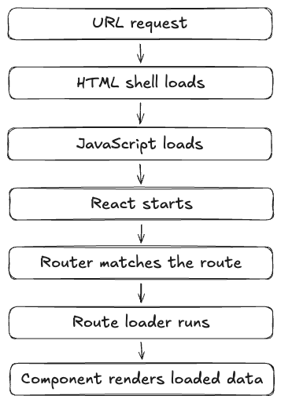

# Lesson 21: Rendering Strategies, Client-Side Rendering Focus

## Install dependencies and run the dev server

Continue working in the same React + Tailwind + DaisyUI project from Lesson 19.

1. Move into your existing project directory:
```sh
cd lesson-19
```
2. Install dependencies (if needed):
```sh
npm install
```
3. Start the dev server:
```sh
npm run dev
```
4. Open the provided dev server URL in your browser

## Start the backend API

Lesson 21 continues using the local backend server.

In a second terminal:

1. Move into the backend folder:
```sh
cd backend
```
2. Install dependencies (first time only):
```sh
npm install
```
3. Start the server:
```sh
npm start
```

The server listens on `http://localhost:3000`.

Keep this server running while you inspect how the client application renders and requests data.

## Lesson focus

This lesson introduces **rendering strategies** for React applications, with a focus on **client-side rendering (CSR)**.

We will:

- examine how a React application renders in the browser
- compare traditional multi-page rendering with CSR
- trace the path from URL to visible UI
- observe how JavaScript, routing, and data loading work together in a CSR app
- identify advantages and tradeoffs of CSR

This lesson is primarily conceptual and observational.

We are not changing the app architecture yet. Instead, we are using the existing application to understand what the browser is doing.

## Connecting to prior lessons

So far, students have built a React application that includes:

- route-based navigation
- route loaders and actions
- client-side interactivity
- data loading in a React application

But an important question remains:

> How does the browser actually get from a URL to a visible user interface?

Before moving into server-side rendering in the next lesson, we need a strong mental model of **how client-side rendering works first**.

## Phase 1: Compare traditional rendering and client-side rendering

Start by contrasting two different web application models.

### Traditional multi-page application

In a traditional web app:

1. the browser requests a URL
2. the server returns a full HTML page
3. the browser renders that page
4. clicking a link typically causes another full request for another HTML page

### Client-side rendered React application

In a CSR React app:

1. the browser requests a URL
2. the server returns a small HTML shell and JavaScript assets
3. JavaScript loads in the browser
4. React renders the visible UI into the page
5. later navigation often happens without a full page reload

Important idea:

- in traditional apps, the server usually renders the page
- in CSR apps, the browser usually renders the page

## Phase 2: Inspect the initial HTML shell

Open the project’s `index.html` file.

You should see something similar to this:

```html
<!doctype html>
<html lang="en">
  <head>
    <meta charset="UTF-8" />
    <meta name="viewport" content="width=device-width, initial-scale=1.0" />
    <title>Vite App</title>
  </head>
  <body>
    <div id="root"></div>
    <script type="module" src="/src/main.jsx"></script>
  </body>
</html>
```

Discuss what is present and what is missing.

Notice:

- the page includes a root container
- the actual UI is not present in the HTML file
- the browser must load JavaScript before the app becomes visible

This is one of the defining traits of CSR.

## Phase 3: Trace the render chain from `main.jsx`

Open `src/main.jsx`.

You should see the application being mounted into the root element.

Example:

```jsx
import { StrictMode } from 'react';
import { createRoot } from 'react-dom/client';
import { RouterProvider } from 'react-router';

import './index.css';
import { router } from './router';

createRoot(document.getElementById('root')).render(
  <StrictMode>
    <RouterProvider router={router} />
  </StrictMode>
);
```

This is the render chain:

1. the browser loads `main.jsx`
2. React mounts into `#root`
3. the router determines which route should render
4. the corresponding layout and page components render
5. the visible UI appears

Important idea:

- the initial UI is created in the browser, not delivered as completed HTML from the server

## Phase 4: Trace CSR with routing and route loaders

Because the application now uses React Router data mode, the browser performs several steps during initial rendering.

A simplified flow looks like this:



This is still client-side rendering.

Even though the route loader fetches data before the page component renders, the entire process is still initiated in the browser after JavaScript has loaded.

This is an important distinction to emphasize before Lesson 22.

## Phase 5: Observe the network behaviour in DevTools

Open the browser DevTools and go to the **Network** tab.

Reload the app.

Look for:

- the initial HTML document
- JavaScript module files
- CSS assets
- API requests for route loader data

Discuss what loads first and what loads later.

A common pattern you should notice:

1. the browser gets the HTML shell
2. the browser downloads JavaScript
3. the browser starts the React app
4. the app makes API requests
5. the UI updates with the fetched data

## Phase 6: Observe client-side navigation

Now click through the application routes.

Examples:

- navigate from the directory page to the admin page
- navigate between resources on the admin page
- return to create mode

Watch both:

- the browser URL
- the Network tab

Important observations:

- the page does not fully reload on route navigation
- React Router changes the visible UI without a full document request
- data requests may still occur, but navigation remains client-driven

**This is one of the biggest benefits of CSR in React applications.**

## Phase 7: Test what happens when JavaScript is missing

Use DevTools or browser settings to simulate JavaScript being disabled.

Then refresh the page.

Discuss what happens.

In a CSR app, you should notice that:

- the HTML shell still loads
- very little or none of the meaningful UI appears
- the app depends heavily on JavaScript to render content

This is one of the key tradeoffs of CSR.

## Phase 8: Summarize the strengths of CSR

Now that you have inspected the application behaviour, summarize the advantages.

### Common advantages of CSR

- rich interactivity after the app loads
- smooth in-app navigation
- strong support for component-driven UI updates
- can be deployed as static assets in many cases
- works very well for highly interactive applications

This is one reason CSR became such a common model for React applications.

## Phase 9: Summarize the tradeoffs of CSR

CSR also has tradeoffs.

### Common tradeoffs of CSR

- slower time to first meaningful content on initial load
- the browser must download and execute JavaScript before rendering the app
- more dependence on client device performance
- can complicate SEO and content discovery if HTML is not pre-rendered
- the application may appear blank or incomplete until scripts and data finish loading

> Important idea:
> 
> **CSR is not bad.**
> 
> It is simply one rendering strategy with strengths and limitations.

## Phase 10: Compare CSR to server-side rendering at a high level

Before the next lesson, we will make the distinction explicit.

### CSR

- browser renders the UI
- initial HTML is usually minimal
- JavaScript must load before the full interface appears

### SSR

- server renders the initial HTML for the route
- browser receives meaningful page content sooner
- the client later hydrates the page to make it interactive

For now, this is only a preview.

In the next lesson, we will build and inspect an SSR version directly.

## Key Concepts Reinforced

- rendering strategy is an architectural decision
- client-side rendering means the browser builds the UI after JavaScript loads
- route loaders in data mode still participate in a CSR pipeline when the app is browser-rendered
- CSR provides smooth navigation and rich interactivity
- CSR also introduces initial-load and JavaScript-dependency tradeoffs

## Assessment

Students should be able to explain:

- what client-side rendering is
- what the browser receives on first load in a React app
- how React, the router, and route loaders contribute to visible UI
- one advantage of CSR
- one tradeoff of CSR

## Student Exercise

Answer the following questions in writing:

1. What is client-side rendering?
2. What is the purpose of the `#root` element in `index.html`?
3. What happens between loading `main.jsx` and seeing the app UI?
4. Identify one advantage and one tradeoff of CSR.

Optional extension:

Inspect another website in DevTools and decide whether it appears to use traditional server rendering, CSR, or another rendering strategy.
